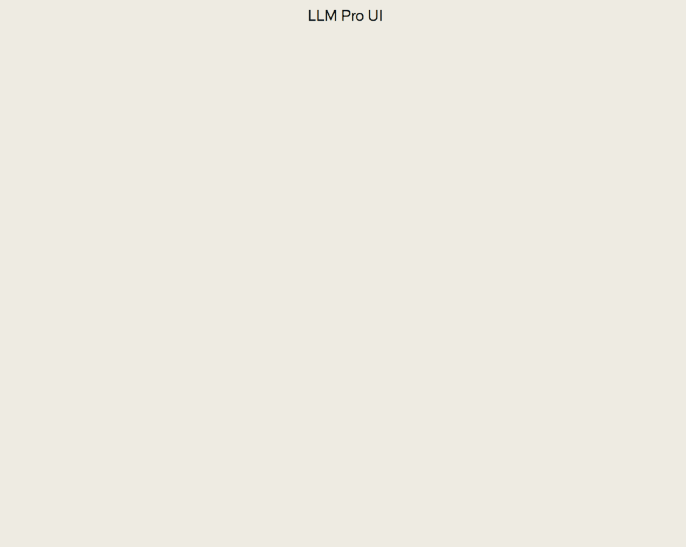
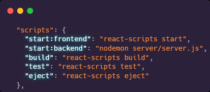

# LLM Pro UI

A minimalist web-UI created with the goal of providing more granular control of LLMs (large language models) for adept users. Try it out here ! ---> [LLM Pro UI](https://llm-pro-ui.vercel.app/)

## ⭐️Features

### Text-To-Speech
This app uses Google Cloud's text-to-speech API in order to read out any message at the user's request by clicking the play button beside the message entry's display name.

### Export to PDF
Any conversation can be saved as a PDF for later use.

### Parameter Control
Sidebar includes settings to change how the outputs of the model are generated.
* Temperature - This setting controls how randomness is used when the model predicts the next token. It ranges from .1 to 1.0 with .1 being the most random and 1.0 being the most deterministic.
* Max Tokens - This setting allows control of the maximum length of the conversation and/or responses. Best to keep as high as the selected model allows for most situations.

### System Prompts
System Prompts are short descriptions of how the AI should behave when responding. They are appended to the top of each request sent. LLM Pro UI allows you to easily change the system prompt at any point in the conversation and includes some presets for convenience.

### Token Tracking
Tokens are bits of text that are read and produced by the model. Tokens are usually around 3 characters. The LLM's of today have limits to how many tokens can be included in responses as well as limits to how many can be in the conversation as a whole before it loses a significant amount of functionality or stops working completely. The sidebar allows you to track how many tokens are being used so the user can be mindful of the limitation and plan accordingly.

### Themes
Try the different color themes!

### Conference Call Mode
Conference Call is the most novel feature of the project. One of the goals of the LLM Pro UI tool is to allow expirimentation of ways to structure prompts and there are more modes to come in the future such as "Tree of Thought"\
This mode will allow you to converse with two separate "entities" in the large language model by allowing the user to have two separate system prompts, simulating a three-way conversation. If one "entity" addresses the other, the conversation will continue automatically with no needed input from the user.

## ⭐️Upcoming Features
* Dialogs that explain the parameters on hover
* UI updates and fixes
* Additional conversational modes
* History for previous conversations

## 📖 How to Use
1. Download or fork the repository.
2. In the `server.js` backend, replace the `API_KEY` value with your OpenAI API key: `const API_KEY=paste your API key here;`
3. In the frontend `AppContext.js` file, replace the URLs for the endpoints with localhost URLs so you can run the app locally.
    * Replace `"https://llm-pro-ui-server.onrender.com/completions"` with `"http://localhost:8000/completions"`
    * Replace `"https://llm-pro-ui-server.onrender.com/text-to-speech"` with `"http://localhost:8000/text-to-speech"`
4. In the `package.json` file, right-click and run the script for the backend, then do the same for the frontend. The page should load in your default browser, then you are ready to go !

## 🐞Bugs and Issues
* Export to PDF only printing first page of chatfeed
* The way some prompts are formatted will cause the response to use more tokens than the allowed maximum despite the limitation
* TTS not working on mobile
* Codebase needs a major refactor and tests

## 👨‍💻Built With

React.js | Node.js | OpenAI API | Google Cloud TTS | Vercel | Render.com

## 🪪License
This is a personal project, and as such, there is no license applied. It's currently not open for further contributions. However, please do feel free to explore the code and use it for learning purposes!

Please note, this project uses the OpenAI API and Google Cloud Text-to-Speech, so if you plan to use similar systems, be sure to review and adhere to their respective terms of service and usage guidelines. 

* [OpenAI's usage policies](https://platform.openai.com/docs/usage-policies/)
* [Google Cloud's terms of service](https://cloud.google.com/terms)